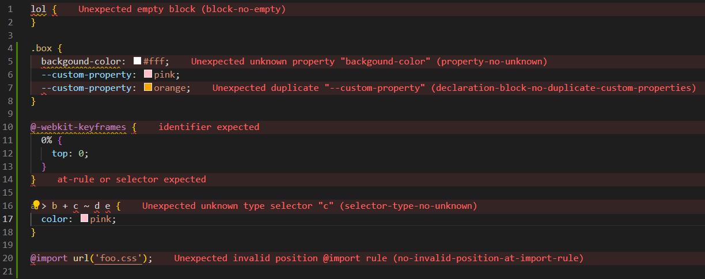

# UpLeveled Stylelint Config

UpLeveled Stylelint defaults for styling in CSS, SCSS, Sass, CSS Modules and CSS-in-JS.

## Setup

Follow the setup instructions for the [UpLeveled ESLint Config](https://www.npmjs.com/package/eslint-config-upleveled)
